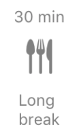

# ToolBarItem.js
##### Used to display current timer mode and for switching to another one

## Props
- *topText* - text above the icon
- *bottomText* - text below the icon
- *icon* - display icon
- *isActive* - shows current timer mode
- *onPress* - action, triggered by clicking on the item

